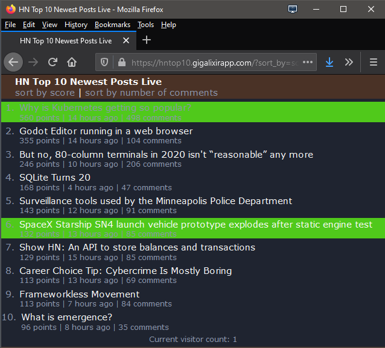

# HNLive

HNLive is a small Elixir/Phoenix/LiveView web app showing the top 10 (by score or number of comments) newest [HackerNews](https://news.ycombinator.com/) stories in "real time" (i.e. as quickly as updates become available via the [HackerNews API](https://github.com/HackerNews/API)).

The app should be running on https://hntop10.gigalixirapp.com - please note that this is running on the free tier with limited memory and resources.



As seen in the screenshot above, updated rows (i.e. position, score or number of comments has changed) are briefly highlighted using a green background. The app uses a dark theme inspired by a [discussion on HackerNews](https://news.ycombinator.com/item?id=23197966). 

The motivation for building HNLive was twofold:
  * I had read and heard many good things about [Elixir](https://elixir-lang.org/), [Phoenix](https://www.phoenixframework.org/) and [LiveView](https://hexdocs.pm/phoenix_live_view/Phoenix.LiveView.html), and after watching Chris McCord`s demo ["Build a real-time Twitter clone in 15 minutes with LiveView and Phoenix 1.5"](https://www.youtube.com/watch?v=MZvmYaFkNJI), I finally said to myself: "That looks awesome, time to learn Elixir and Phoenix!" HNLive is the app I built over the last couple of days while on this learning journey, so don't expect idiomatic or bug-free code - feel free to point out potential improvements!
  * I love browsing [HackerNews](https://news.ycombinator.com/), but the selection of stories on the front page, the ["newest" page](https://news.ycombinator.com/newest) and the ["best" page](https://news.ycombinator.com/best) is not ideal if you want to see at a glance which new stories (say, submitted over the course of the last 12 hours) have received the most upvotes or are discussed particularly controversially (as judged by the number of comments). HNLive attempts to address this using data from the [HackerNews API](https://github.com/HackerNews/API) to provide the top 10 submissions, sorted by score or number of comments, taking into account only the last 500 submissions. I also wanted to see updates to the top 10 (and scores and number of comments) in real time, which was made easy by using LiveView. 

To start your Phoenix server:

  * Setup the project with `mix setup`
  * Start Phoenix endpoint with `mix phx.server`

Now you can visit [`localhost:4000`](http://localhost:4000) from your browser.

Ready to run in production? Please [check the official Phoenix deployment guides](https://hexdocs.pm/phoenix/deployment.html).

## Learn more

  * Official website: https://www.phoenixframework.org/
  * Guides: https://hexdocs.pm/phoenix/overview.html
  * Docs: https://hexdocs.pm/phoenix
  * Forum: https://elixirforum.com/c/phoenix-forum
  * Source: https://github.com/phoenixframework/phoenix

## How this was built

`mix phx.new hnlive --module HNLive --live --no-ecto`

Confirm installation of dependencies.

Update to latest Phoenix and LiveView versions in mix.exs:

``` 
{:phoenix, "~> 1.5.3"},
{:phoenix_live_view, "~> 0.13.0"},
```

Add HTTPoison dependency:

`{:httpoison, "~> 1.6"}`

Run `mix deps.get`.

`cd hnlive`

`mix setup`

`mix phx.server`

Add `/.elixir_ls/` to .gitignore if using ElixirLS.

To the supervision tree in `HNLive.Application`, add 

```
# Hackney pool used for httpoison requests
:hackney_pool.child_spec(:httpoison_pool, timeout: 15000, max_connections: 30)
```
